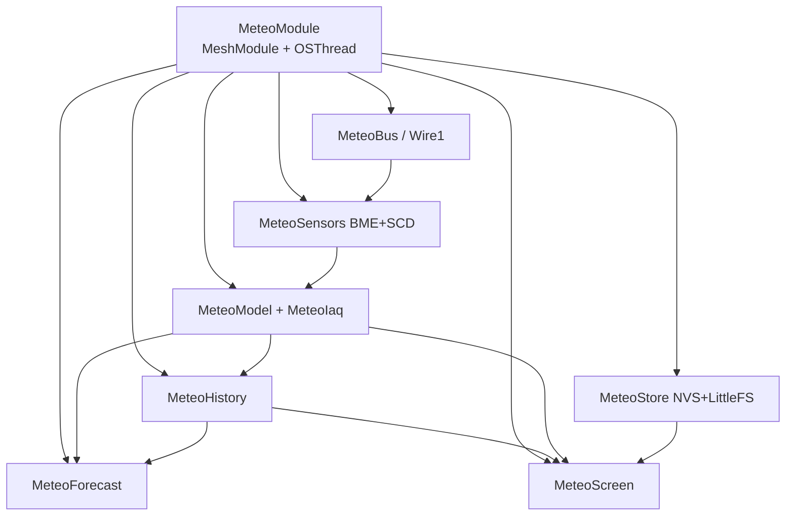

# Meshtastic Meteo（Cardputer-Adv）

在 **M5Stack Cardputer-Adv** 上运行的 Meshtastic 气象站固件：基于 [Meshtastic firmware](https://github.com/meshtastic/firmware) **v2.7.22**（tag `v2.7.22.96dd647`），将 [picoware-meteo](https://github.com/picoware/picoware-meteo) **v1.3.1** 的采集、预报与 UI 移植为 `MeteoModule`（`-D MESHTASTIC_METEO=1`，变体 `m5stack-cardputer-adv`）。

## 硬件

| 组件 | 说明 |
|------|------|
| 主板 | M5Stack Cardputer-Adv（ESP32-S3，ST7789 **240×135**） |
| ENV Pro | Grove BME688，I2C 地址 **0x77** |
| CO2L | Grove SCD41，I2C 地址 **0x62** |
| PaHUB（可选） | 地址 **0x70–0x76**，6 通道轮询 |
| GPS | UART **RX=15** / **TX=13**，115200 baud |

**Grove 总线（传感器）** 使用 **I2C1**：`SDA=G2`、`SCL=G1`（`Wire1`，超时 50 ms）。  
**机内 I2C**（键盘 TCA8418、IMU 等）为 **G8/G9**，与 Grove 分开，勿混接。

## 功能

### 页面（6 个导航页 + SETTINGS）

| 页 | 内容 |
|----|------|
| **OVERVIEW** | 四格卡片：温度、湿度、气压、CO₂（含 CO₂ 等级色边） |
| **AIR** | BME688 估算 IAQ、VOC 电阻与趋势、预热进度 |
| **FORECAST** | 三子页：**Outlook**（SLP、3 h 变化、斜率、Zambretti 短语、收集进度）；**Models**（Zambretti / Sailor / Hygro 评分与集成）；**Confidence**（历史覆盖、一致性、露点与 RH 因子） |
| **CHART** | 六通道曲线（TEMP / HUM / PRESS / CO₂ / GAS / IAQ），ST7789 RGB 直写 |
| **STATS** | 两子页：传感器状态与 SLP 统计；预报方法与 3 h 变化 |
| **RAW** | 三子页：显示/原始值、BME 诊断、SCD 诊断 |
| **SETTINGS** | 海拔 (m)、主题、Chart 窗口 (s)、Log 间隔 (s)、南半球 (Y/N)、检测到的 PaHUB 地址（只读） |

导航页顺序：`;`/`k` 在 OVERVIEW → AIR → FORECAST → CHART → STATS → RAW 间循环；`M` 进入 SETTINGS（不在循环内）。

### 采样与预报

- **BME688**：forced 模式，过采样 OS_T=4 / OS_P=8 / OS_H=2；约 **3 s** 触发一次测量
- **数据 ingest**：**1 s** 写入历史环与 SLP 环
- **SCD41**：**ECO** 模式，约 **30 s** 读一次 CO₂
- **预报**：站压 → 海平面气压 (SLP)；**3 h** 环缓冲（**36** 点）；稳健斜率；Zambretti + Sailor + Hygro 集成
- **时钟**：`getValidTime(RTCQualityGPS)`；无有效 GPS/RTC 时 UI 显示 **NO RTC**，且不从 `millis` 恢复 SLP 历史

## 架构



| 目录 / 文件 | 职责 |
|-------------|------|
| `MeteoBus.*` | Grove I2C1、PaHUB 选通、设备扫描 |
| `MeteoSensors.*` | BME688 / SCD41 驱动与校准 |
| `MeteoModel.*` | 显示值、SLP、传感器状态 |
| `MeteoIaq.*` | IAQ / eCO₂ / bVOC 估算 |
| `MeteoForecast.*` | Zambretti、趋势、置信度 |
| `MeteoHistory.*` | 图表环、SLP 环、斜率统计 |
| `MeteoStore.*` | NVS 设置、SLP2 文件、CSV 日志 |
| `MeteoScreen.*` | 240×135 UI、Chart RGB、按键 |
| `MeteoModule.*` | 调度、ingest、输入拦截 |
| `tools/validate_forecast_golden.py` | 预报黄金向量核对（开发用） |

帧激活时 `MeteoModule` 拦截键盘输入；Chart 页在 `afterUiDisplay` 回调中对 ST7789 写入 RGB 曲线。

## 构建与刷写

需要 [PlatformIO](https://platformio.org/) 与 ESP32 工具链。

```bash
pio run -e m5stack-cardputer-adv
pio run -e m5stack-cardputer-adv -t upload --upload-port COMx
```

将 `COMx` 替换为实际串口。

## 按键（Cardputer 键盘）

| 按键 | 作用 |
|------|------|
| `;` / `j` / → | 下一导航页（6 页循环） |
| `k` / ← | 上一导航页 |
| `M` | 进入 SETTINGS |
| `O` `A` `F` `T` `I` `X` | 跳转 OVERVIEW / AIR / FORECAST / CHART / STATS / RAW |
| `T` `H` `P` `C` `G` `Q` | 进入 CHART 并选中对应通道 |
| `U` / `D` | FORECAST / STATS / RAW 子页；SETTINGS 中移动光标 |
| `;` / `k`（SETTINGS） | 调整当前设置项 |
| **Enter** | SETTINGS：**保存**并返回 OVERVIEW |
| **ESC** / Backspace | SETTINGS：**不保存**并返回 OVERVIEW |
| `L` | 开关 CSV 记录（立即写 NVS） |
| `R` | 重新扫描 I2C / PaHUB |

SETTINGS 中 Chart 间隔可选 **15 / 30 / 60 / 120 / 300** s；Log 间隔可选 **0 / 10 / 30 / 60 / 300** s（0 = 关闭）。

## 存储

| 类型 | 位置 | 说明 |
|------|------|------|
| 设置 | NVS 命名空间 `meteo` | 海拔、主题、chart/log 间隔、南半球、hub 地址等 |
| SLP 历史 | LittleFS `/meteo/slp.bin` | 魔数 **`SLP2`**，Unix 时间戳 + SLP×100；约 15 min 落盘 |
| CSV 日志 | `/meteo/logs/` | 有 RTC 时按日 `YYYY-MM-DD.csv`，否则 `UNSYNCED.csv` |

**SLP 恢复**：仅在启动时存在有效 GPS/RTC 时从 `slp.bin` 恢复；无 RTC 时跳过恢复（不用 `millis` 伪造时间戳）。

## 许可

[GNU GPL-3.0](LICENSE) — 衍生自 [meshtastic/firmware](https://github.com/meshtastic/firmware) 与 picoware-meteo。
